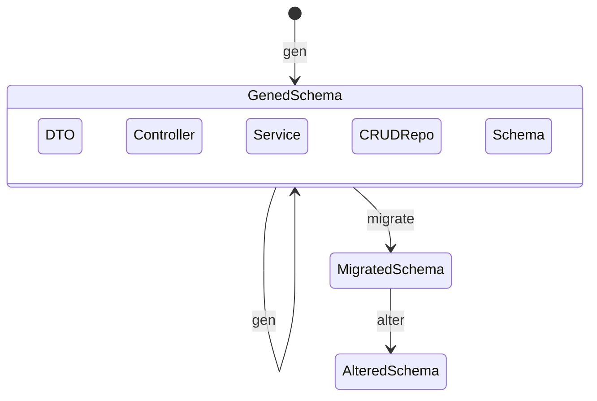
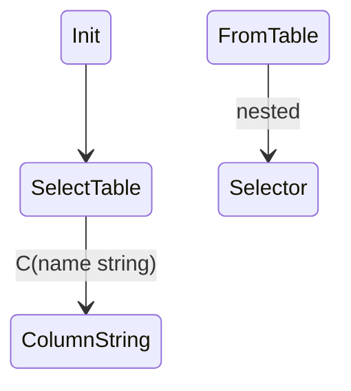

### Diagram
## Storage Layer
1. [Query Builder](#builder)

## Flow State Of GoPhoenix

```mermaid
    stateDiagram-v2
        [*] --> GenedSchema: gen
        GenedSchema --> GenedSchema: gen
        state GenedSchema {
            DTO
            Controller
            Service
            CRUDRepo
            Schema
        }
        GenedSchema --> MigratedSchema: migrate
        MigratedSchema --> AlteredSchema: alter
```

## Builder 

```mermaid
    stateDiagram-v2
    Init --> SelectTable
    SelectTable --> ColumnString: C(name string)
    FromTable --> Selector: nested
```